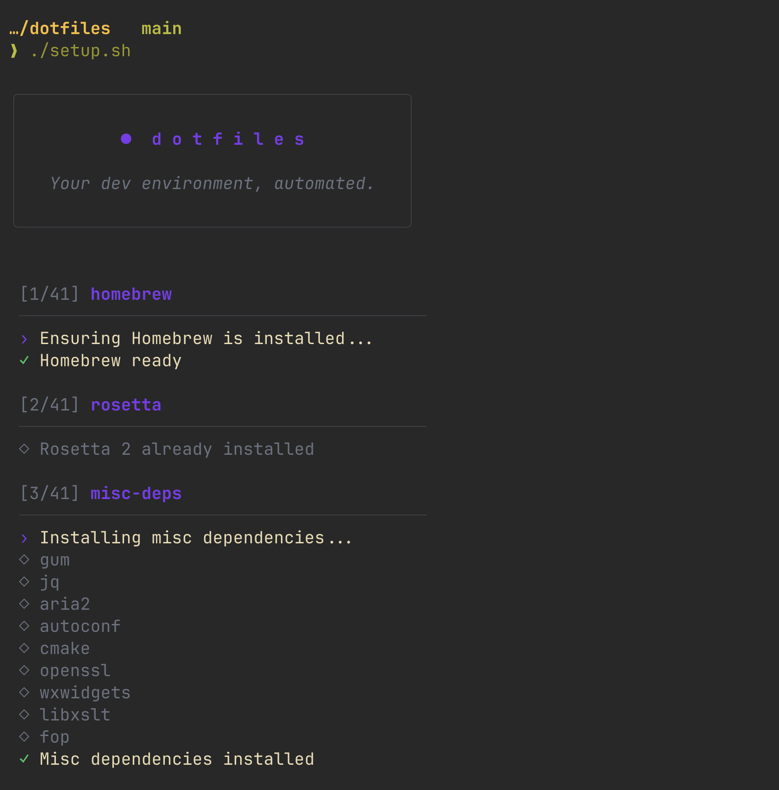

# macOS Dotfiles

> A reproducible macOS setup for people who like to factory-reset their machines

**This is built for Apple Silicon. It might work on Intel — I haven't tried in a while.**

I factory-reset my Macs more than most people. Some of that's practical — I work across multiple laptops and a desktop and a reproducible setup is the only way to stay sane. Some of it's just preference. I like the new-car-smell of a clean install, and resetting periodically forces me to keep my tooling honest: if I can't easily reinstall something, I probably don't need it.

This repo is what gets me from a freshly-wiped Mac to my actual working environment in ~30 minutes, with maybe 2% manual intervention at the end (logging into iCloud, 1Password, the App Store).

Clone the repo and run `./setup.sh` on a clean install. The whole thing is idempotent and you can re-run it anytime to update or restore.

```bash
git clone https://github.com/gregmundy/dotfiles.git
cd dotfiles
./setup.sh
```



---

## What's included

### Development tools

| Category | Tools |
|----------|-------|
| **Languages** | Node.js (nvm), Python (uv), Go, Elixir/Erlang (asdf), Rust (rustup), Java (Temurin), OpenTofu |
| **Editors / IDEs** | VS Code, Cursor, PyCharm, Neovim, Vim |
| **Containers** | Docker |
| **API Testing** | Postman, Insomnia, HTTPie |
| **Database** | DBeaver, NoSQLBooster, MongoDB Atlas CLI, RedisInsight |
| **Mobile** | Watchman, CocoaPods |
| **Version Control** | Git, Git LFS, GitHub CLI |
| **Linting / Formatting** | Biome, ShellCheck |

### CLI tools

| Category | Tools |
|----------|-------|
| **Search & Navigation** | ripgrep, fzf, zoxide, eza |
| **Viewers** | bat, jless, tldr |
| **Data Wrangling** | jq, yq, httpie |
| **Git & GitHub** | gh, lazygit, delta |
| **System & Containers** | btop, lazydocker |
| **Shell & Sessions** | tmux, direnv, gum |
| **Version & Package** | asdf, mas |
| **Downloads** | aria2 |

### Applications

| Category | Apps |
|----------|------|
| **Productivity** | Raycast, Obsidian, Notion, Todoist, Linear, Figma, AppCleaner |
| **Communication** | Slack, Discord, Zoom |
| **Browsers** | Chrome, DuckDuckGo |
| **AI** | Claude, ChatGPT, Cursor, Cursor CLI, opencode, LM Studio, Ollama, llamavm |
| **Media** | Spotify |
| **Security** | 1Password, 1Password CLI |
| **Entertainment** | Steam |

### System configuration

- **Terminal**: Ghostty with Gruvbox Dark theme, JetBrains Mono Nerd Font
- **Shell**: Zsh with Oh My Zsh, Starship prompt, custom aliases and functions
- **Multiplexer**: tmux
- **Window Manager**: Rectangle
- **App Store**: `mas` for installing Apple Developer and TestFlight
- **macOS Defaults**: Optimized Finder, Dock, keyboard settings

---

## Dotfiles managed

```
dotfiles/
├── claude/          # Global Claude Code settings (plugins + allows)
├── editorconfig/    # Project-agnostic editor defaults
├── ghostty/         # Terminal emulator config
├── git/             # gitconfig, gitignore_global
├── nvim/            # Neovim configuration (init.lua)
├── nvm/             # Default npm packages for new Node versions
├── ssh/             # SSH config (1Password agent)
├── starship/        # Starship prompt config (Gruvbox Dark)
├── tmux/            # tmux configuration
├── vim/             # Vim configuration (.vimrc)
├── vscode/          # VS Code settings and keybindings
└── zsh/             # Aliases, functions, PATH additions
```

---

## On the choices

This is an opinionated setup. The tools here aren't a survey of what's available — they're what I've landed on after years of swapping things in and out. If you fork this, expect to disagree with at least a third of the choices.

A few of the picks worth defending:

**Ghostty over iTerm2.** I used iTerm2 for many years and Ghostty made the switch worth it. The config is plain text, the speed is unreal on Apple Silicon, and the defaults are saner than iTerm's accumulated complexity.

**Raycast over Spotlight, Alfred, and LaunchBar.** They're all solving the same problem. Raycast just got there cleanest, and the extension ecosystem means I can stop building my own scripts for things other people have already built well.

**uv over pip, pipenv, and poetry.** uv won. The other tools haven't fully realized it yet. Speed alone justifies it; the lock file format and resolver are a bonus.

**Starship over Oh My Zsh themes.** I want my prompt to be fast and config-driven, not a community Frankenstein I have to debug when something breaks. Starship is one TOML file and it works.

**Neovim *and* VS Code, not one or the other.** I keep trying to commit to one and keep coming back to using both. Neovim for terminal-context work and quick edits, VS Code (and increasingly Cursor) for longer sessions and anything visual. I've stopped trying to pick.

**Local AI tools alongside cloud ones.** LM Studio and Ollama for local inference, Claude and ChatGPT for frontier work. The setup reflects how I actually use AI — local by default for the things that should stay local, cloud when the capability earns it.

---

## Why shell scripts and not Nix?

This is a totally fair question, especially in 2026. I considered Nix seriously and decided against it for this specific job.

Nix's promise — fully declarative, reproducible, atomic — is real, and the people who get over the learning curve genuinely love it. The trade-off is that everything you do has to go through Nix's abstractions, and the curve is steep enough that I lose the property I actually care most about: *being able to read every line of my setup and know exactly what it does*. Shell scripts are transparent. If something breaks during setup, I can read the script that broke and fix it without consulting documentation.

I also looked at Ansible (heavier than I want for personal use), chezmoi (well-designed for templated multi-machine configs, but my setup is uniform across machines), and dotbot (too thin for what I needed). Plain shell scripts plus Homebrew Bundle hits the sweet spot of *enough automation, no abstractions I don't understand*.

If you're already happy with Nix, you should keep using Nix. This isn't an argument against it — it's a different set of priorities.

---

## Architecture

### Installer scripts

Scripts in `install/` run in numeric order:

| Range | Category |
|-------|----------|
| `00-09` | Bootstrap (Homebrew, CLI tools) |
| `10-19` | System configuration (macOS defaults) |
| `20-29` | Build tools (Xcode, mas) |
| `30-39` | Terminal & shell (Ghostty, Zsh, Neovim) |
| `40-49` | Window management, Git, SSH |
| `50-59` | Browsers |
| `60-69` | Productivity & communication |
| `70-79` | Dev tools (Docker, IDEs, databases) |
| `80-89` | Mobile development (Watchman, CocoaPods) |
| `90-99` | Language runtimes |

### Library functions

Helper functions in `lib/` are sourced by installers:

- **bootstrap.sh** — Sources the other libs and provides the `log()` dispatcher
- **ui.sh** — Gum-powered UI helpers (sections, spinners, deferred notes)
- **brew.sh** — `brew_ensure`, `brew_install_formula`, `brew_install_cask`
- **fs.sh** — `ensure_dir`
- **apps.sh** — `app_installed` (checks `/Applications` and `~/Applications`)
- **xcodes.sh** — Xcode version management

---

## Post-install setup

Some tools require manual configuration after install:

### 1Password SSH agent
Enable in 1Password: **Settings → Developer → SSH Agent**

### Git identity
The installer prompts for your name and email, stored in `~/.gitconfig.local` (not committed).

### App Store apps
Sign into the App Store before running setup. The installer uses `mas` to install Apple Developer and TestFlight.

---

## Customization

### Adding a new installer

1. Create `install/XX-name.sh` with appropriate number prefix
2. Add standard header:
   ```bash
   #!/usr/bin/env bash
   set -euo pipefail
   source "$(cd "$(dirname "${BASH_SOURCE[0]}")/.." && pwd)/lib/bootstrap.sh"
   ```
3. Use `log` for all output
4. Use `brew_install_formula` or `brew_install_cask`
5. Make idempotent (check before installing)

### Adding dotfiles

1. Add config files to `dotfiles/appname/`
2. Create an installer to symlink or copy them
3. Use `cmp -s` to check if files are already up to date
